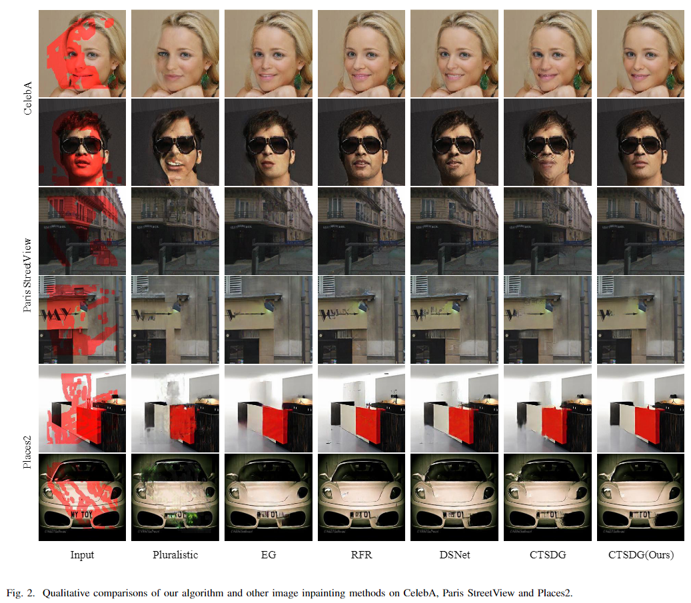

# Auxiliary Loss Reweighting for Image Inpainting
[Paper](https://arxiv.org/pdf/2111.07279) | [Pre-trained Models](https://pan.baidu.com/s/1PetUGzwtLJzXErUfFDArbw)

Siqi Hui, Sanping Zhou, Ye Deng, Jinjun Wang<br>


## Introduction
The code is based on [CTSDG](https://github.com/Xiefan-Guo/CTSDG). We choose CTSDG as inpaint model and replace perceptual and style loss of CTSDG with Tunable Perceptual Loss (TPL) and Tunable Style Loss (TSL) respectively. We also apply AWA algorithm to alter between optimizing model parameters and auxiliary parameters of TPL and TSL.


## Prerequisites

- Python >= 3.7
- PyTorch >= 1.8
- NVIDIA GPU + CUDA cuDNN

## Getting Started

### Installation

- Clone this repo:

```
git clone https://github.com/HuiSiqi/Auxiliary-Loss-Reweighting-for-Image-Inpainting.git
cd Auxiliary-Loss-Reweighting-for-Image-Inpainting
```

- Install PyTorch and dependencies from [http://pytorch.org](http://pytorch.org/)
- Install python requirements:

```
pip install -r requirements.txt
```

### Datasets

**Image Dataset.** We evaluate the proposed method on the [CelebA](http://mmlab.ie.cuhk.edu.hk/projects/CelebA.html), [Paris StreetView](https://github.com/pathak22/context-encoder), and [Places2](http://places2.csail.mit.edu/) datasets, which are widely adopted in the literature. 

**Mask Dataset.** Irregular masks are obtained from [Irregular Masks](https://nv-adlr.github.io/publication/partialconv-inpainting) and classified based on their hole sizes relative to the entire image with an increment of 10%.

### Training 

```
python train.py \
  --image_root [path to image directory] \
  --mask_root [path mask directory] \
  --save_dir= [path to checkpoint directory] \
  --log_dir= [path to log directory] \
  --pre_trained= [path to resume checkpoint] \
  --train_iter= [training iteration] \
  --finetune_iter= [finetune iteration]
```

__Distributed training support.__ You can train model in distributed settings.

```
python -m torch.distributed.launch --nproc_per_node=N_GPU train.py
```

For example, to train the network on Places2 dataset using gpu 0 and 1, with pretrained models
```
CUDA_VISIBLE_DEVICES='0,1' python -m torch.distributed.launch --nproc_per_node=2 train.py --image_root ./dataset/places2 --mask_root ./dataset/mask --pre_trained ./ckpt/places2/1000000.pth
```

### Testing

To test the model, you run the following code.

```
python test.py \
  --pre_trained [path to checkpoints] \
  --image_root [path to image directory] \
  --mask_root [path to mask directory] \
  --result_root [path to output directory] \
  --number_eval [number of images to test]
```

### How long to train the model for
All the descriptions below are under the assumption that the size of mini-batch is 6

For Paris Street View Dataset, train the model for 400,000 iterations and finetune for 200,000 iterations. (600,000 in total)

For CelebA Dataset, train the model for 350,000 iterations and finetune for 150,000 iterations. (500,000 in total)

For Places2 Challenge Dataset, train the model for 2,000,000 iterations and finetune for 1,000,000 iterations. (3,000,000 in total)


## Citation

If any part of our paper and repository is helpful to your work, please generously cite with:

```
@article{hui2021auxiliary,
  title={Auxiliary Loss Adaption for Image Inpainting},
  author={Hui, Siqi and Zhou, Sanping and Wan, Xingyu and Wang, Jixin and Deng, Ye and Wu, Yang and Gong, Zhenghao and Wang, Jinjun},
  journal={arXiv preprint arXiv:2111.07279},
  year={2021}
}
```
